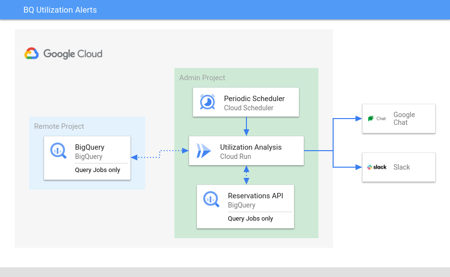

<!-- 
Copyright 2021 Google LLC

Licensed under the Apache License, Version 2.0 (the "License");
you may not use this file except in compliance with the License.
You may obtain a copy of the License at

    https://www.apache.org/licenses/LICENSE-2.0

Unless required by applicable law or agreed to in writing, software
distributed under the License is distributed on an "AS IS" BASIS,
WITHOUT WARRANTIES OR CONDITIONS OF ANY KIND, either express or implied.
See the License for the specific language governing permissions and
limitations under the License.
-->

# Solution Guide

This solution implements a ChatOps-like approach to monitoring slot utilization of Google Cloud BigQuery reservations.

As an alternative to using BigQuery in its default on-demand mode, users can purchase reserved slot capacity in the form of [commitments](https://cloud.google.com/bigquery/docs/reservations-intro). Once committed, reservations can be created and assigned to Google Cloud Resource Manager objects like organizations, folders or directly to projects. When BigQuery jobs run inside projects with assigned reservations they will consume slots from the reservations rather than consuming compute resources on-demand.

Although this mode of consumption sometimes better aligns with how some organizations wish to use BigQuery (e.g. more control, predictability of spend, internal CAPEX-like processes/budgets), it comes with a challenge: capacity needs to be continuously monitored and occasionally adjusted to meet the needs of workloads.

This repository contains a blueprint, which enables users to create a bot-like service, which constantly monitors the utilization of configured BigQuery reservations. The service will periodically retrieve BigQuery reservations, assignments and jobs in order to compute total slot utilization across all of the reservations. Once a resevation is crossing a configurable utilization threshold, the service publishes alert messages to Slack and/or Google Chat webhooks. These messages are intended to inform BigQuery operators about approaching saturation in slot utilization. A possible fix for this could be a temporary increase in capacity by adding [flex slots](https://cloud.google.com/blog/products/data-analytics/introducing-bigquery-flex-slots).

To ease the setup of this service, this repository also contains an interactive tutorial in Google CloudShell, which walks users through the setup of the infrastructure.

## Solution Architecture

The solution architecture distinguishes between two types of Google Cloud projects: a single admin project and multiple remote projects.

The bulk of the infrastructure and the service itself will be deployed into the admin project. The admin project should be the project, which is being used to setup and manage the BigQuery commitments and reservations.

A set of remote projects or organizations can then be configured and grant permissions to the service, so it can retrieve the currently active BigQuery jobs from the projects.

## Requirements

The service is designed to publish messages to chat platforms. Currently, this works with [Slack](https://slack.com) and/or [Google Chat](https://chat.google.com). You will need the ability to create pre-signed webhook URLs for chat rooms and configure these with the service.

The functionality should be easily extendable to also include other chat platform (e.g. [rocket.chat](https://rocket.chat)).

Furthermore, a couple of local tools are required to complete the deployment. Deployment was tested with these:

- Go 1.17
- Terraform v1.0.7
- Google Cloud SDK 364.0.0

If you are deploying this solution using the interactive CloudShell tutorial, the required tools should already be present in the shell.

## Caveats

The service is only inspecting query jobs.
